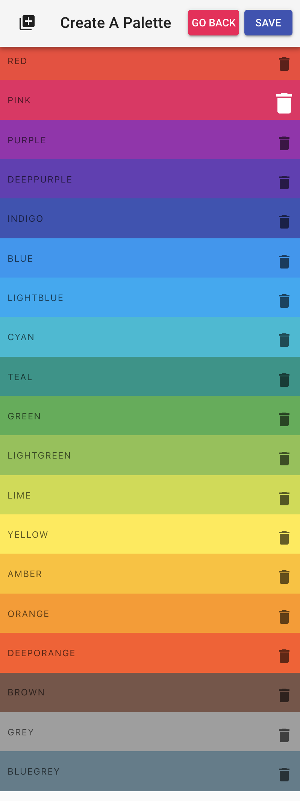

# React Color Project

- A clone of websites like [Flat UI Colors](https://flatuicolors.com/) and [Material UI Colors](http://materialuicolors.co/?utm_source=launchers).

### Live Demo

To see the app in action, go to [colorApp](https://kdord-color-project.netlify.com)

### Features

- Ability to create a palette
- Allows to choose the following color formats: hex, rgb, rgba

